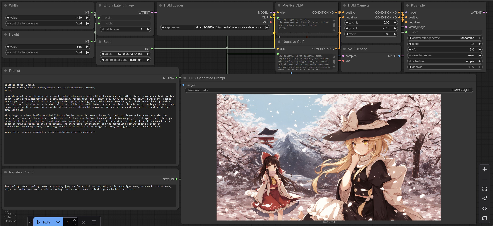

# HDM-ext: official ComfyUI model loader for HDM-xut models

## Introduction
* HDM: https://github.com/KohakuBlueleaf/HDM
* Model: https://huggingface.co/KBlueLeaf/HDM-xut-340M-anime

## Requirements
* Transformers library >= 4.52
    * For Qwen3 suppport

## A note on "Custom Model Loader"
This repository is not only the loader for HDM model, it is also an example on "Making model loader for custom model while support ComfyUI's builtin nodes" (As you can see, in our example, only the Loader and a "HDM Camera" node are custom, other node are standard built-in nodes.)

[WIP]

## License
This project is still under developement, therefore all the models, source code, text, documents or any media in this project are licensed under `CC-BY-NC-SA 4.0` until the finish of development.

For any usage that may require any kind of standalone, specialized license. Please directly contact kohaku@kblueleaf.net